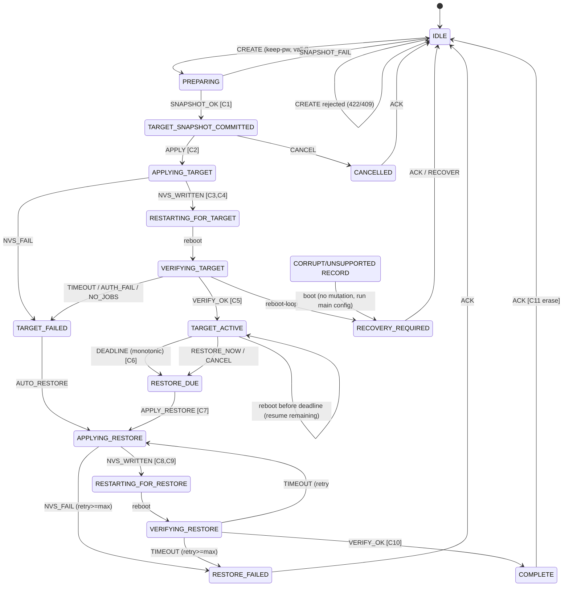

# NeuralAxe OS — Phase 2M.1A

## Timed Pool Sessions — Firmware-Owned State Machine

Companion to `NEURALAXE_PHASE_2M1A_TIMED_POOL_SESSIONS_AUDIT.md`. **Design only — no firmware written.**
Board target: Gamma / 601 / BM1370. One session at a time. Keep-current password only (MVP).

> Legend: **[REC]** recommendation · **[FACT]** observed in repo · **[IDF]** framework guarantee · **[INFER]** reasoned.
> "Record" = the persistent dual-slot A/B NVS session record (audit report §11). "Commit point" = the single-entry
> `active_slot` write that makes a new record generation authoritative (`[IDF]` single-entry NVS write is power-safe).

---

## 1. State Definitions

Each state is classified **persistent** (its `state` byte lives in the record and survives reboot) or **ephemeral** (recomputed within a boot from the persistent state + live telemetry; never the sole authority).

| State | Class | Meaning | Entry condition |
|---|---|---|---|
| `IDLE` | persistent (implicit: no record) | No session exists | boot with no record, or after `ack` cleanup |
| `PREPARING` | ephemeral | Request validated, about to snapshot source | valid `create` accepted |
| `TARGET_SNAPSHOT_COMMITTED` | **persistent** | Immutable source identity captured in record; **no pool mutation yet** | source snapshot written + committed |
| `APPLYING_TARGET` | **persistent** | Target pool config being written to NVS | snapshot committed, begin target write |
| `RESTARTING_FOR_TARGET` | ephemeral | `esp_restart()` issued to apply target | target NVS committed |
| `VERIFYING_TARGET` | ephemeral | Post-reboot: waiting for connected+mining+target host | boot in `APPLYING_TARGET`/after restart |
| `TARGET_ACTIVE` | **persistent** | Target verified; **timer running** (monotonic) | verification bar met within budget |
| `RESTORE_DUE` | **persistent** | Deadline reached (or Restore Now/Cancel-after-apply) | monotonic elapsed ≥ duration, or operator/boot decision |
| `APPLYING_RESTORE` | **persistent** | Source config being written back to NVS | restore initiated |
| `RESTARTING_FOR_RESTORE` | ephemeral | `esp_restart()` issued to apply restore | restore NVS committed |
| `VERIFYING_RESTORE` | ephemeral | Waiting for connected+mining+source host | boot in `APPLYING_RESTORE`/after restart |
| `COMPLETE` | **persistent** | Restore verified; result retained until acknowledged | restore verification met |
| `TARGET_FAILED` | **persistent** | Target never verified within budget/retries → auto-restore path | verify budget or retries exhausted |
| `RESTORE_FAILED` | **persistent** | Restore not verified after bounded retries | restore retries exhausted |
| `INTERRUPTED` | **persistent (transient)** | Reboot/power-loss mid-mutation detected; reconcile pending | boot finds mutation-in-progress state |
| `RECOVERY_REQUIRED` | **persistent** | Safe automatic action exhausted; operator must act | corrupt record / reboot-loop / restore-failed-final |
| `CANCELLED` | **persistent (terminal)** | Operator cancelled; ended cleanly | cancel accepted (pre-apply) |

**Terminal (await `ack` → cleanup):** `COMPLETE`, `CANCELLED`, `RESTORE_FAILED`(final), `RECOVERY_REQUIRED`.
`TARGET_FAILED` is terminal-for-target but transitions into the restore path automatically before becoming terminal.

---

## 2. Persistent vs Ephemeral — why

`[REC]` Only states that must survive a reboot to keep the safety invariants are persisted:
- The **source snapshot** must be durable *before* any mutation → `TARGET_SNAPSHOT_COMMITTED` is the first persistent milestone (Invariants 1, 2).
- The **timer-running** fact and its start reference must be durable → `TARGET_ACTIVE` persists `verified_start_epoch`, `deadline_epoch(+valid)`, `monotonic_start_us`, `boot_id`.
- The **restore-in-progress** fact must be durable so a crash during restore resumes restore, never target → `APPLYING_RESTORE`, `RESTORE_DUE`.
- Everything that is merely "in-flight this boot" (restarting, verifying, preparing) is **ephemeral**: on reboot the scheduler recomputes it from the last persistent state + `esp_reset_reason()` + telemetry. This avoids persisting rapidly-changing states and keeps NVS writes to true milestones (flash-wear + atomicity friendly).

---

## 3. Transition Table

Format: **State — Event → Next [commit point] {side effect}**. `t_reconnect = 90 s`, `t_verify = 45 s` (from `pool-verify.ts`). `retry_max` per transition = 3.

| From | Event | To | Commit point | Side effect |
|---|---|---|---|---|
| IDLE | `CREATE(valid, keep-pw)` | PREPARING | — | validate duration∈[900,86400], profile, `passwordMode==keep`; acquire lease |
| IDLE | `CREATE(different-pw)` | IDLE | — | **reject 422** `ERR_PW_MODE_UNSUPPORTED` |
| IDLE | `CREATE` while lease held | (unchanged) | — | **reject 409** `ERR_SESSION_EXISTS` |
| PREPARING | `SNAPSHOT_OK` | TARGET_SNAPSHOT_COMMITTED | **write record (gen+1, source snapshot)** | source primary+fallback identity frozen (non-secret) |
| PREPARING | `SNAPSHOT_FAIL` | IDLE | — | release lease, `ERR_SNAPSHOT` |
| TARGET_SNAPSHOT_COMMITTED | `APPLY` | APPLYING_TARGET | **write record (state=APPLYING_TARGET)** | begin writing target NVS keys |
| TARGET_SNAPSHOT_COMMITTED | `CANCEL` | CANCELLED | **write record (CANCELLED)** | source untouched; clean end |
| APPLYING_TARGET | `NVS_WRITTEN` | RESTARTING_FOR_TARGET | (record already APPLYING_TARGET) | `esp_restart()` after `retry_count` bump |
| APPLYING_TARGET | `NVS_FAIL` | TARGET_FAILED | **write record (TARGET_FAILED)** | do not restart; go to restore path |
| RESTARTING_FOR_TARGET | *(reboot)* | VERIFYING_TARGET | — | boot: reset_reason checked; begin verify window |
| VERIFYING_TARGET | `VERIFY_OK` (connected+mining+target host) | TARGET_ACTIVE | **write record (TARGET_ACTIVE + start refs)** | start monotonic timer; clear retry_count |
| VERIFYING_TARGET | `VERIFY_TIMEOUT` / `AUTH_FAIL` / `NO_JOBS` | TARGET_FAILED | **write record (TARGET_FAILED, failure_code)** | begin auto-restore |
| VERIFYING_TARGET | *(reboot loop, retry>max)* | RECOVERY_REQUIRED | **write record** | force source config; operator |
| TARGET_ACTIVE | `DEADLINE` (monotonic elapsed≥duration) | RESTORE_DUE | **write record (RESTORE_DUE)** | — |
| TARGET_ACTIVE | `RESTORE_NOW` / `CANCEL` | RESTORE_DUE | **write record (RESTORE_DUE, reason)** | operator-initiated early restore |
| TARGET_ACTIVE | *(reboot, before deadline)* | VERIFYING_TARGET→TARGET_ACTIVE | **write record (new monotonic_start,boot_id)** | resume remaining duration (§6) |
| TARGET_ACTIVE | *(reboot, deadline passed by trusted time)* | RESTORE_DUE | **write record** | restore immediately |
| RESTORE_DUE | `APPLY_RESTORE` | APPLYING_RESTORE | **write record (APPLYING_RESTORE)** | write source NVS keys from snapshot |
| APPLYING_RESTORE | `NVS_WRITTEN` | RESTARTING_FOR_RESTORE | (record APPLYING_RESTORE) | `esp_restart()` after retry bump |
| APPLYING_RESTORE | `NVS_FAIL` (retry<max) | APPLYING_RESTORE | **write record (retry++)** | retry write |
| APPLYING_RESTORE | `NVS_FAIL` (retry≥max) | RESTORE_FAILED | **write record** | operator |
| RESTARTING_FOR_RESTORE | *(reboot)* | VERIFYING_RESTORE | — | boot: begin restore verify |
| VERIFYING_RESTORE | `VERIFY_OK` (connected+mining+source host) | COMPLETE | **write record (COMPLETE, restore_verified)** | retain result until ack |
| VERIFYING_RESTORE | `VERIFY_TIMEOUT` (retry<max) | APPLYING_RESTORE | **write record (retry++)** | retry restore |
| VERIFYING_RESTORE | `VERIFY_TIMEOUT` (retry≥max) | RESTORE_FAILED | **write record** | operator; source config kept active |
| TARGET_FAILED | `AUTO_RESTORE` | APPLYING_RESTORE | **write record** | same restore path |
| any persistent | `CORRUPT_RECORD` (boot, both slots bad CRC) | RECOVERY_REQUIRED | (cannot trust record) | start **normal `main` config**, no mutation |
| COMPLETE / CANCELLED / RESTORE_FAILED / RECOVERY_REQUIRED | `ACK` | IDLE | **erase record slots + active_slot** | cleanup |
| terminal | `duplicate ACK/CREATE (same key)` | (unchanged) | — | idempotent no-op, return current |

---

## 4. Entry / Exit Actions

| State | Entry action | Exit action |
|---|---|---|
| PREPARING | validate request; acquire operation lease | — |
| TARGET_SNAPSHOT_COMMITTED | freeze source identity (host/port/user/tls/proto/useFallback — **no password**) into record | — |
| APPLYING_TARGET | write target pool NVS keys (namespace `main`); bump `retry_count` before restart | — |
| VERIFYING_TARGET | start `t_reconnect`/`t_verify` timers; sample `pool-verify` signals | stop timers |
| TARGET_ACTIVE | record `verified_start_epoch`(if clock), `deadline_epoch(+valid)`, `monotonic_start_us`, `boot_id`; reset `retry_count`; start deadline poll | — |
| RESTORE_DUE | record reason (deadline / restore-now / cancel / target-failed) | — |
| APPLYING_RESTORE | write source NVS keys from frozen snapshot; bump `retry_count` | — |
| VERIFYING_RESTORE | start verify timers; compare active host to **source** | stop timers |
| COMPLETE | classify restore quality (exact / operational-fallback / partial); freeze result | on ACK: erase record |
| RECOVERY_REQUIRED | ensure **source** (or `main`) config is what's running; expose recovery options | on operator action |

---

## 5. Commit Points (power-loss checkpoints)

`[REC]` A record write is atomic at the **`active_slot` single-entry commit** (audit §11). The scheduler performs mutation only in an order where a crash at any point is recoverable:

```
C0  (no record)                      → crash: nothing to recover; IDLE
C1  write record: SOURCE SNAPSHOT    → crash before C1: IDLE (source untouched)
                                        crash after  C1: source known; can cancel safely
C2  write record: state=APPLYING_TARGET
C3  write target NVS keys (main ns)   → crash between C2..C3: boot sees APPLYING_TARGET,
                                        target maybe partial → reconcile = REAPPLY SOURCE (safe)
C4  esp_restart() for target          → crash: same as C3 (record still APPLYING_TARGET)
C5  write record: state=TARGET_ACTIVE → crash before C5: verify not asserted → treat as
    (+ start refs)                      VERIFYING_TARGET on boot; crash after C5: timer authoritative
C6  timer elapses; write RESTORE_DUE  → crash before C6: still TARGET_ACTIVE (re-eval deadline)
C7  write record: APPLYING_RESTORE
C8  write source NVS keys (main ns)    → crash between C7..C8: boot sees APPLYING_RESTORE →
                                         reconcile = REAPPLY SOURCE (idempotent, safe)
C9  esp_restart() for restore
C10 write record: COMPLETE             → crash before C10: still APPLYING/VERIFYING_RESTORE →
                                         re-verify; never claims COMPLETE without evidence (Inv 10)
C11 ACK: erase record                  → crash during erase: record still terminal → ACK again
```

**Key invariant of the ordering `[INFER]`:** the **source snapshot (C1) precedes the first pool mutation (C3)**, and the **restore-in-progress marker (C7) precedes the restore write (C8)** — so any crash reconciles toward *source*, never toward an unverified target. `TARGET_ACTIVE` (C5) is written **only after** verification, so the timer never starts on an unverified target (Invariant 3).

---

## 6. Restart Behavior per State

| Persistent state at boot | `esp_reset_reason()` use | Pool config started | Action |
|---|---|---|---|
| (none) | — | normal `main` | IDLE |
| TARGET_SNAPSHOT_COMMITTED | any | **source** (never mutated) | resume or await CANCEL |
| APPLYING_TARGET | SW/WDT/PANIC/POWERON | **reapply source** | INTERRUPTED → auto-restore (Inv 2) |
| TARGET_ACTIVE (deadline not passed) | any | **target** | start SNTP; new `boot_id`+`monotonic_start`; run **remaining** duration = `duration − already_elapsed_before_reboot`; already_elapsed persisted at each `TARGET_ACTIVE` heartbeat (§7) |
| TARGET_ACTIVE (deadline passed per **SNTP-trusted** clock) | any | target briefly | → RESTORE_DUE immediately |
| TARGET_ACTIVE (deadline unknown, **SNTP time not yet trusted**) | any | target during bounded SNTP wait only | on window expiry → **fail-safe restore** |
| RESTORE_DUE | any | **source** | APPLYING_RESTORE |
| APPLYING_RESTORE | any | **reapply source** | VERIFYING_RESTORE |
| COMPLETE | any | normal `main` | await ACK |
| RESTORE_FAILED / RECOVERY_REQUIRED | any | **source** best-effort / `main` if corrupt | await operator |
| WDT/PANIC loop (retry>max) | TASK_WDT/PANIC repeated | **source** | RECOVERY_REQUIRED (reboot-loop guard) |

**Remaining-duration accounting `[REC]`:** to survive reboots *before* the deadline without losing elapsed time, the scheduler persists `elapsed_accumulated_s` on a coarse heartbeat (e.g. every 60 s while `TARGET_ACTIVE`) and on graceful state changes. On reboot in `TARGET_ACTIVE`, `remaining = duration − elapsed_accumulated_s`; a new monotonic base is set. This bounds over/under-run to one heartbeat interval and avoids per-second flash writes.

---

## 7. Timeout & Retry Behavior

| Concern | Bound | On exhaustion |
|---|---|---|
| Reconnect after target restart | `t_reconnect = 90 s` | TARGET_FAILED → auto-restore |
| Target verify after reconnect | `t_verify = 45 s` | TARGET_FAILED → auto-restore |
| Reconnect/verify after restore restart | 90 s / 45 s | retry (≤3) then RESTORE_FAILED |
| **SNTP** trusted-time acquisition after reboot (deadline unknown) | bounded window (proposed default 10 min, hard max 15) | **fail-safe restore** to captured source |
| Per-transition NVS write/restart retry | `retry_max = 3` | next terminal/recovery state |
| Reboot-loop guard | `retry_count` across boots, same transition | RECOVERY_REQUIRED |
| Heartbeat (elapsed persistence) | every 60 s while TARGET_ACTIVE | — |

`[REC]` No unbounded waits anywhere. Verification uses **bounded levels** (audit §9.3); a session can never sit in `VERIFYING_*` forever — it times out to a terminal/restore path. The timer never advances while in `VERIFYING_TARGET` (Invariant 4): the requested duration begins only at `TARGET_ACTIVE`. Deadline evaluation uses **monotonic time within a boot** and, across a reboot, the **SNTP-backed trusted clock only** (audit §7) — pool `ntime` is never trusted for timing. If SNTP (or DNS) is unavailable, the bounded window expires to a **fail-safe restore**, which itself needs no clock.

---

## 8. Terminal Outcomes & History Wording

| Terminal | Meaning | History wording `[REC]` |
|---|---|---|
| COMPLETE (exact) | restore verified on **primary** source host, Case A password unchanged | "Session complete — restored to original pool and mining resumed." |
| COMPLETE (operational) | restore verified but on **fallback** source host | "Session complete — restored (operational: mining via fallback)." |
| COMPLETE (partial) | source applied + reconnected, host not confirmed at final timeout | "Session ended — original settings reapplied; pool match not confirmed. Verify on Pools page." |
| CANCELLED | operator cancelled before/at apply | "Session cancelled by operator." |
| TARGET_FAILED (→restore) | target never verified; auto-restored | "Target pool did not start; original pool restored automatically." |
| RESTORE_FAILED | restore not verified after retries | "Restore did not verify — device is on the original settings; check pool reachability." |
| RECOVERY_REQUIRED | corrupt record / reboot-loop / unrecoverable | "Timed session needs attention — automatic recovery was stopped for safety." |

**Never** claim exact password restoration (Case A means the persisted password was never changed, so "restored" refers to host/account/config — Invariant 11). No secret ever appears in any wording, export, or GET (Invariant 12).

---

## 9. Idempotency

`[REC]` Every externally-triggered transition is idempotent:
- `CREATE` carries a client `idempotencyKey`; a repeat with the same key returns the existing `session_id` (no second session — Invariant: one at a time).
- `RESTORE_NOW`, `CANCEL`, `ACK`, `RECOVER` are keyed by `session_id` + current `generation`; applying the same event to an already-advanced state is a no-op returning current state.
- Internal reconcile (boot) is naturally idempotent: reapplying the *source* snapshot is safe to repeat; `active_slot` selection is deterministic (highest valid generation).

---

## 10. Mermaid State Diagram



---

## 11. Power-Loss Checkpoint Matrix (condensed)

| Crash at | Record state after | Boot reconciliation | Pools mutated? | Safe? |
|---|---|---|---|---|
| before C1 | none | IDLE | no | ✅ |
| between C1–C3 | TARGET_SNAPSHOT_COMMITTED / APPLYING_TARGET | reapply **source** | maybe partial target → overwritten by source | ✅ (Inv 1,2) |
| during target NVS write (C3) | APPLYING_TARGET | reapply source | partial target discarded | ✅ |
| after C4, before C5 | APPLYING_TARGET | VERIFYING_TARGET; if verify fails → restore | target running unverified | ✅ (never marked ACTIVE) |
| after C5 | TARGET_ACTIVE | resume timer (remaining) | target (verified) | ✅ |
| during heartbeat write | TARGET_ACTIVE (old elapsed) | resume with ≤1 interval over-run | target | ✅ |
| after C6 | RESTORE_DUE | APPLYING_RESTORE | — | ✅ |
| between C7–C8 | APPLYING_RESTORE | reapply source (idempotent) | partial source → completed | ✅ |
| during restore NVS write (C8) | APPLYING_RESTORE | reapply source | partial discarded | ✅ |
| after C9, before C10 | APPLYING_RESTORE | VERIFYING_RESTORE | source running | ✅ (never COMPLETE w/o proof, Inv 10) |
| after C10 | COMPLETE | await ACK | source | ✅ |
| during ACK erase (C11) | terminal (partially erased slot) | pick valid slot / re-ACK | none | ✅ |
| both slots corrupt anytime | unreadable | RECOVERY_REQUIRED, run **main** config, **no mutation** | none | ✅ (Inv 7) |

**Scope of this matrix `[INFER]`:** the dual-slot + `generation` + CRC design guarantees **crash-consistency** — it survives torn writes, interrupted commits, accidental corruption, and *accidental* selection of an older-but-valid slot. The `crc32` is **accidental-corruption / error detection, NOT authenticity** — it is not a MAC or signature, and any attacker who can write flash can recompute it. It therefore does **not** provide anti-rollback or anti-forgery: with no Secure Boot / flash- / NVS-encryption / secure monotonic counter, an attacker with **offline flash access** can substitute an older internally-valid record **or forge an entirely arbitrary one** (any state / pool / deadline) and the loader will accept it. That **malicious offline rollback-or-forgery is a documented residual risk**, not covered here — see the audit report §15 and the Security report threat matrix. "Highest valid generation wins" defends against accidents, not adversaries.

---

## 12. Mapping to Safety Invariants

1. Source captured before mutation → **C1 precedes C3**. ✅
2. Source snapshot immutable (never overwritten by target) → snapshot is a separate frozen record field, target writes go to `main` NVS only. ✅
3. Not active until verified → `TARGET_ACTIVE`/C5 only after `VERIFY_OK`. ✅
4. Duration not consumed during connect → timer starts at C5, bounded verify before it. ✅
5. Never indefinitely on target after expiry → monotonic deadline within a boot + **SNTP-backed trusted clock** across reboots (pool `ntime` never trusted) + bounded SNTP wait → fail-safe restore + boot forces restore. ✅
6. Deterministic recovery on reboot/power loss → §6/§11 tables. ✅
7. Corrupt record never mutates pools → CORRUPT→RECOVERY_REQUIRED runs `main`, no writes. ✅
8. One owner → single scheduler task + persisted lease. ✅
9. Manual change can't destroy restore contract → PATCH pool fields 409 while lease held. ✅
10. Completion only on restore proof → COMPLETE/C10 requires `VERIFY_OK` on source host. ✅
11. No false exact-password claim → Case A only; wording refers to config, not password read-back. ✅
12. Secrets never in status/logs/history/exports/GET → no password field in record or API. ✅
13. Different-pw unattended rejected → CREATE 422 unless encrypted storage proven. ✅
14. Chain explicit, never hostname-inferred → `source_chain`/`target_chain` from applied profile. ✅
15. Bounded retries → `retry_max=3` per transition. ✅
16. Reboot loops prevented → reboot-loop guard via `retry_count` + `esp_reset_reason()`. ✅
17. 601/BM1370 only → board gate at CREATE. ✅
